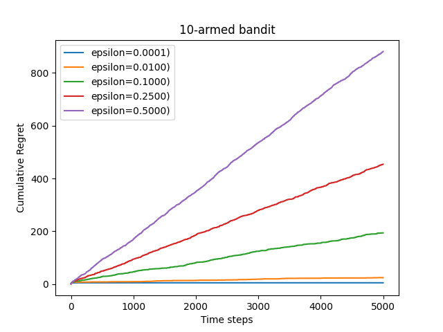
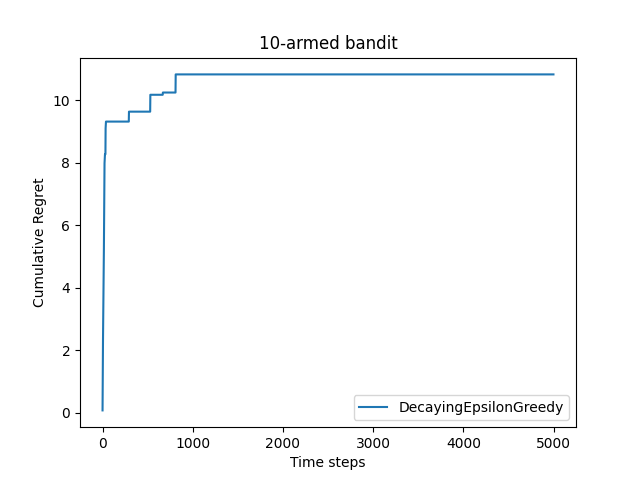
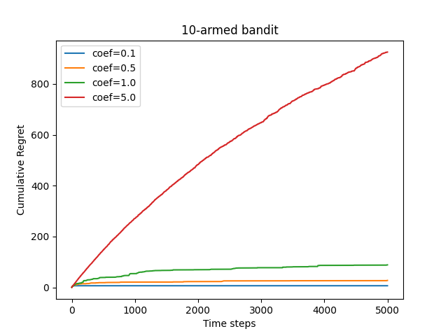
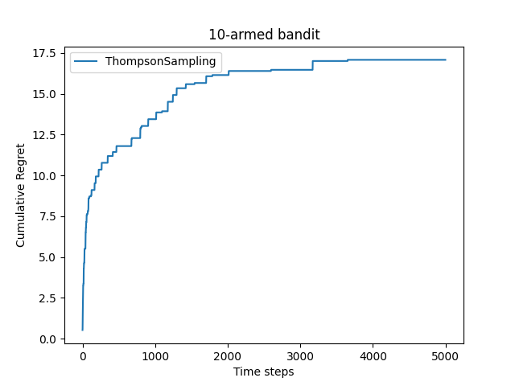
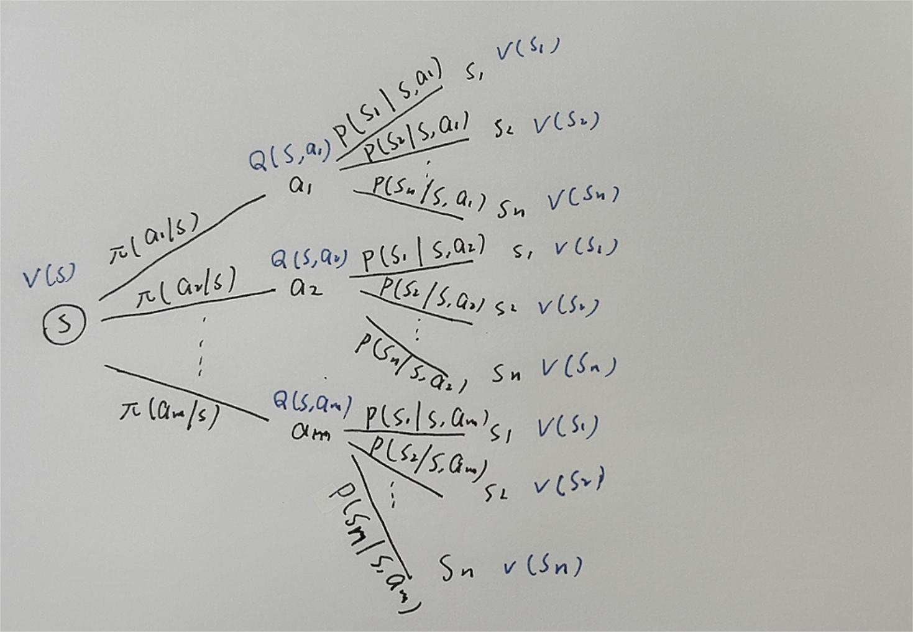
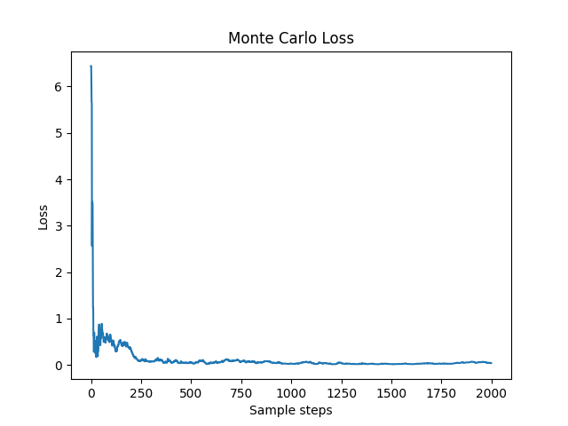

《动手强化学习》个人代码实现

# chapter 2 Multi-armed bandit problem

- 与强化学习不同，多臂老虎机不存在状态信息，只有动作和奖励，算是最简单的“和环境交互中的学习”的一种形式；
- 多臂老虎机中的**探索**和**利用**问题一直是经典的问题；

## 2.1 EpsilonGreedy

- 每次以 $1-\epsilon$ 的概率选择以往经验中期望奖励估值最大的拉杆（利用），以 $\epsilon$ 的概率随机拉动一根拉杆（探索）。
- $\epsilon$ 可随时间衰减，但不可以衰减到 0，否则求出的结果一定是局部信息最优解

不带衰减版本的累计懊悔值增长曲线如下，近似线性增长的过程



带衰减版本的累计懊悔值增长曲线如下，近似次线性增长，性能有所提升



## 2.2 UCB

霍夫丁不等式 $P(E[X]\ge \bar{x}_n+u)\le e^{-2nu^2}$

- 于是， $P\{Q(a)<\hat{Q(a)}+\sqrt{\frac{-\ln p}{2*n}} \}>1-p$

- 若 $p$ 取一个较小值，那么上式很大概率成立，相当于求得了期望奖励 $Q(a)$ 的一个**置信上界**，以此为标准进行动作的选择

- 令 $U(a)=\sqrt{\frac{-\ln p}{2*n}}$，这个量就可以表示**不确定性**；

  - 若某个拉杆被拉了很多次，则我们对这个拉杆的分布了解得就越多，不确定性就越小；

  于是，$\hat{Q(a)+U(a)}$ 就可以看做是 **期望奖励** 和 **不确定性** 的一个平衡，于是我们也可以添加一个比例系数 $c$，控制平衡关系，改变为 $\hat{Q(a) +c*U(a)}$

​		总结，UCB算法在每次选择拉杆前，先估计拉动每根拉杆的**期望奖励上界**，使得拉动每根拉杆的期望奖励只有一个较小的概率 $p$ 超过这个上界，接着选出期望奖励上界最大的拉杆，从而选择最有可能获得最大期望奖励的拉杆

累计懊悔值增长曲线如下，次线性增长的过程



## 2.3 ThompsonSampling

- 假设每个拉动每根拉杆的奖励服从一个特定的概率分布，然后根据拉动每根拉杆的期望奖励来进行选择
- 对当前每个动作 $a$ 的奖励概率分布进行一轮采样，得到一组各根拉杆的奖励样本，再选择样本中奖励最大的动作
- 通常用 Beta 分布对当前每个动作的奖励概率进行建模

累计懊悔值增长曲线如下，次线性增长的过程



# chapter 3 Markov decision process

## 3.1 Markov process

**马尔可夫性质：** 当前仅当某时刻的状态只取决于上一时刻的状态时，一个随机过程被称为具有马尔科夫性质

**马尔科夫过程：** 具有马尔科夫性质的随机过程，满足 $P(s_t|s_{t-1},s_{t-2},...,s_{1})=P(s_t|s_{t-1})$

- 用 ```<S,P>``` 描述一个马尔科夫过程。 $S$ 是有限数量的状态集合， $P$ 是状态转移矩阵，其第 $i$ 行第 $j$ 列元素表示从状态 $s_i$ 转移到 $s_j$ 的概率 $P(s_j|s_i)$

## 3.2 Markov reward process

**马尔科夫奖励过程：** 在马尔科夫过程的基础上加入奖励函数 $r$ 和折扣因子 $\gamma$

- 用 ```<S,P,r,gamma>``` 表示一个奖励过程
  - $r$ 是奖励函数，某个状态 $s$ 的奖励 $r(s)$ 表示转移到该状态时可以获得的奖励的期望
  - $\gamma$ 是折扣因子，用来对未来的累计奖励进行折扣

**回报：** 在一个马尔科夫奖励过程中，从 $t$ 时刻状态 $S_t$ 开始，直到终止状态，所有奖励的衰减之和，公示如下：

- $G_t=R_t+\gamma R_{t+1}+\gamma^2R_{t+2}+...=\sum_{k=0}^{\infty}\gamma^kR_{t+k}$

**价值函数**：一个状态的期望回报被称为价值，所有状态的价值就组成了**价值函数**

- $\begin{aligned} V(s) &=E[G_t|S_t=s] \\ &=E[R_t+\gamma R_{t+1}+\gamma^2R_{t+2}+...|S_t=s]\\ &=E[R_t+\gamma G_{t+1} |S_t=s]\\ &=E[R_t+\gamma V(S_{t+1})|S_t=s] 	\end{aligned}$
- 得到 $V(s)=r(s)+\gamma\sum_{s'\in S}P(s'|s)V(s')$，这就是贝尔曼方程
- 写成向量和矩阵的形式，就可以得到 $V=R+\gamma PV$，于是可以得到解析解 $V=(I-\gamma P)^{-1}R$

## 3.3 Markov decision process

**马尔科夫决策过程** ：在马尔科夫奖励过程的基础上，加上智能体的动作

- 用 ```<S,A,P,r,gamma>``` 表示
  - $A$ 是动作的集合
  - $r(s,a)$ 是奖励函数，此时奖励可以同时取决于状态 $s$ 和动作 $a$
  - $P(s'|s,a)$ 是状态转移函数，表示在状态 $s$ 执行动作 $a$ 之后到达状态 $s'$ 的概率

**价值函数：** 分为状态价值函数和动作价值函数，分别表示在某状态下的期望回报和在某状态执行某动作下的期望回报

- 状态价值函数： $V^\pi(s)=E_{\pi}[G_t|S_t=s]$
- 动作价值函数： 
  - 对当前状态 $s$ 执行动作 $a$ 得到的期望回报	$Q^\pi(s,a)=E_{\pi}[G_t|S_t=s,A_t=a]$
  - 状态 $s$ 的价值等价于执行所有动作的期望回报的期望    $V^\pi(s)=\sum_{a\in A}\pi(a|s)Q^\pi(s,a)$
  - 在状态 $s$ 执行动作 $a$ 得到的期望回报等于，即时奖励加上衰减后的所有可能的下一个状态的价值期望乘上达到该状态的概率
    - $Q^\pi(s,a)=r(s,a)+\gamma\sum_{s'\in S} P(s'|s,a)V^\pi(s')$ 
- 于是最终的式子就可以统一成以下两个式子
  - $V^\pi(s)=\sum_{a\in A}\pi(a|s)Q^\pi(s,a) $
  - $Q^\pi(s,a)=r(s,a)+\gamma\sum_{s'\in S}P(s'|s,a)V^\pi(s')$ 

(ummm 这个过程要不用个图来表示吧)



**贝尔曼期望方程：** 简单推导一下上面两个方程

- $Q^\pi(s,a)=r(s,a)+\gamma\sum_{s'\in S}P(s'|s,a)\sum_{a'\in A}\pi(a'|s')Q^\pi(s',a')$
- $V^\pi(s)=\sum_{a\in A}\pi(a|s)(r(s,a)+\gamma\sum_{s'\in S}P(s'|s,a)V^\pi(s'))$

​		为了计算给定策略下的**状态价值函数**，我们可以将策略的动作选择**边缘化**，将MDP转化为MRP。具体的说，对于某一个状态，我们根据策略将所有动作的概率进行加权，得到的奖励和就可以被认为是一个MRP在这个状态下的奖励，即：

​						$r'(s)=\sum_{a\in A}r(s,a)\pi(a|s)$

​		同理，我们计算状态转移的概率，也就是将所有动作下到达目标状态的概率加权，得到转移到目标状态的概率，即：

​						$P(s'|s)=\sum_{a\in A}\pi(a|s)P(s'|s,a)$

于是，我们就构造了一个新的MRP： ```<S,P',r',\gamma>```，于是我们就可以用计算解析解的方法解出**状态价值函数**

## 3.4 Monte Carlo method

模拟法，采样多个序列，对序列中出现的每个状态，计算从这个状态往下走得到的价值，做一个平均得到期望



## 3.5 Optimal policy

​		不同的策略会使智能体访问到不同的概率分布（从MDP转换到MRP的过程就可以看出），因此一定存在最优策略。强化学习的目标是找到一个策略，使得智能体从初始状态出发能够获得最多的期望回报。

**策略的偏序关系：** 当且仅当对于任意状态 $s$ 都有 $V^\pi(s) \ge V^{\pi'}(s)$，记 $\pi \ge \pi'$ 

最优策略记为 $\pi^*(s)$

- **最优状态价值函数：** $V^*(s)=\max_{\pi}V^\pi(s),\text{ } \forall s\in S$
- **最优动作价值函数：** $Q^*(s,a) = \max_{\pi}Q^\pi(s,a),\text{ }\forall s\in S,a\in A$

为了使 $Q^\pi(s,a)$ 最大，我们需要在当前的状态动作对 $(s,a)$ 之后**都执行最优策略**。于是得到最优状态价值函数和最优动作价值函数之间的关系：

​						$Q^*(s,a)=r(s,a)+\gamma\sum_{s'\in S}P(s'|s,a)V^*(s')$

最优状态价值，是**选择**此时使最优动作价值最大的那一个动作，得到的状态价值：

​						$V^*(s)=\max_{a\in A}Q^*(s,a)$

**贝尔曼最优方程**

根据上面的关系式子，我们可以得到贝尔曼最优方程

- ​	$V^*(s)=\max_{a\in A} \{ r(s,a)+\gamma\sum_{s'\in S}P(s'|s,a)V^*(s')\}$
- ​    $Q^*(s,a) = r(s,a)+\gamma\sum_{s'\in S}P(s'|s,a)\max_{a'\in A}Q^*(s',a') $